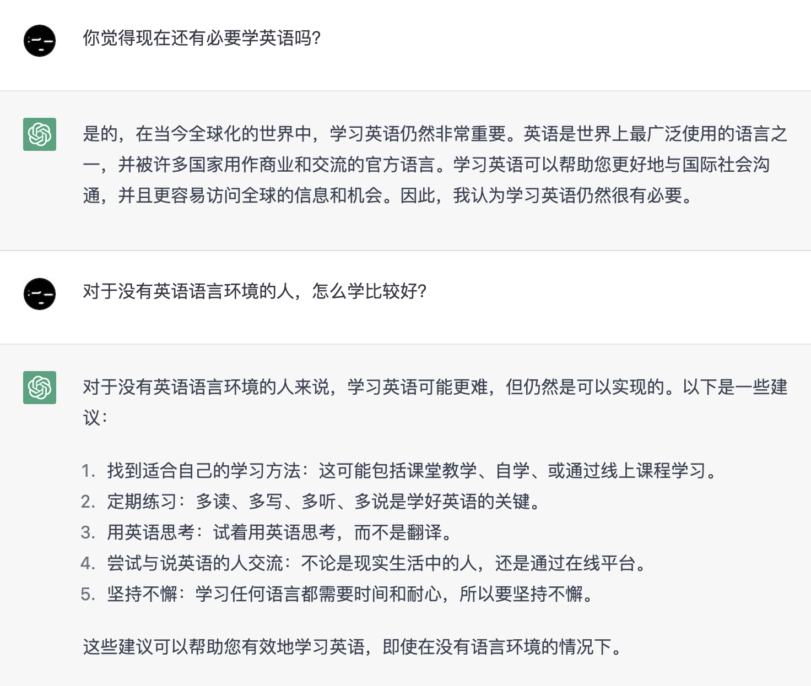

# 📄 前言

<figure><figcaption>
问 ChatGPT：现在还有必要学英语吗？
</figcaption></figure>

这里收集的英语学习材料基本按照难度递增的顺序编排，建议先按顺序浏览一遍目录。

这些材料...

### Cons

⛔ 不是学习英语的捷径，不能让你掌握得比别人更快。

⛔ 不以应试为目的，不会刻意收集应试技巧，更不能满足追求时效的需要。

### Pros

💡 可以节省你寻找学习资源的时间。

💡 一定能让你更接近学习英语的终点。


看到这里，你已经知道 Pros & Cons 的基本意思。


