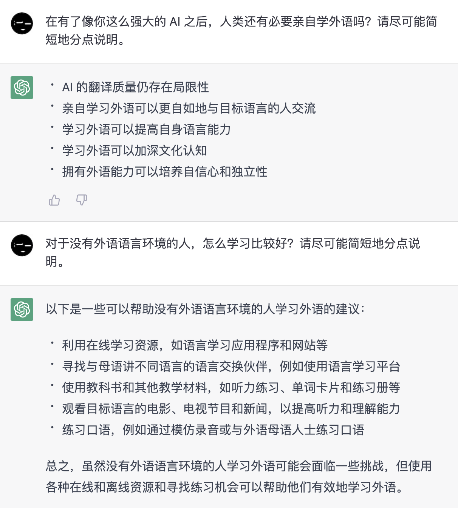

# 📄 前言

<!--@include: ../.vitepress/hack.md-->

## 为什么要学英语

这是一个老生常谈的话题，我们直接看看 ChatGPT 是怎么回答的。

事实上，如果你自己不能回答这个问题，那么可能当下的你并不需要学英语。在这种情况下逼迫自己学，效果应该不会很好。

### 现状与未来

从传统纸质教材、线下培训班，到电子化教材、网课培训班，再到教学 App、线上一对一的外教，学习英语的方式愈发多样且便捷。

GPT4 这类强人工智能的出现，使自学英语的门槛进一步降低（后面会介绍如何利用这类工具构建练习环境）。

在可预见的未来里，也许还会出现科幻电影里面的机器同声传译。到那个时候，对于大部分人来说学英语已经不是难不难的问题，而是有没有必要的问题。

然而……只要人类还在使用不同的自然语言交流，学外语这个需求就不会消失。语言除了是交流的工具，同时还是艺术表达的载体。一个学过英语的人，去电影院看电影大概率不会选择重配音版本。听一首法语歌，懂与不懂法语听起来的感受肯定也不一样。所以，只要还有这一层面的需求，就永远不必担心学习英语是多余的。当然，学习的投资回报率确实不再像原来那么高了。

## 为什么会有这份指引

英语既是传统学校教育重视的科目，也是现代社会工作中不可或缺技能。正因为它被如此重视，关于它的书籍、网课、培训班才会层出不穷。因而，想要在这么多的学习资料里找到优质的、适合自己的反而变得困难。

这正是这份指引存在的意义。

### Cons 👎

* 不是学习英语的捷径，不能让你掌握得比别人更快。
* 不以应试为目的，不会刻意收集应试技巧，更不能满足追求时效的需要。

### Pros 👍

* 可以节省你寻找学习资料的时间。
* 一定能让你更接近学习英语的终点。

> 看到这里，你已经知道 pros & cons 的基本意思。
