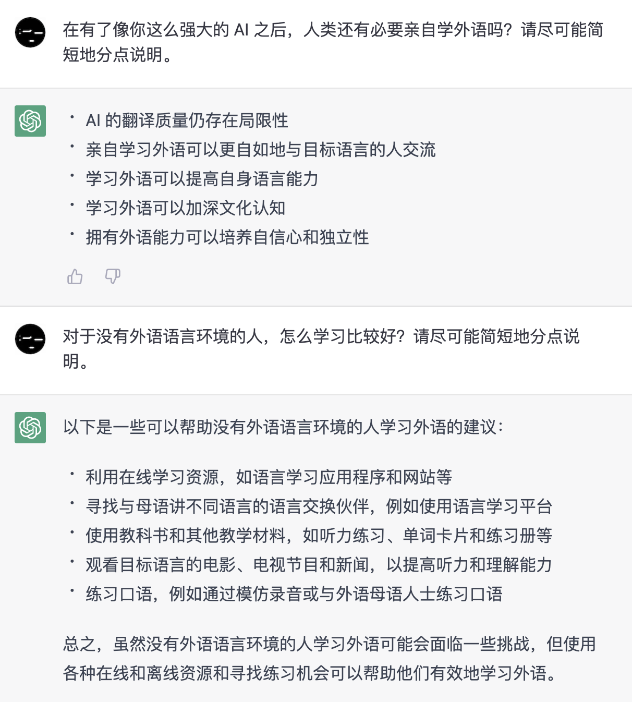

# 📄 前言

<!--@include: ./.vitepress/fm-desc.md-->

这里收集的英语学习材料基本按照难度递增的顺序编排，建议先按顺序浏览一遍目录。

这些材料...

## Cons 👎

* 不是学习英语的捷径，不能让你掌握得比别人更快。
* 不以应试为目的，不会刻意收集应试技巧，更不能满足追求时效的需要。

## Pros 👍

* 可以节省你寻找学习资源的时间。
* 一定能让你更接近学习英语的终点。

> 看到这里，你已经知道 pros & cons 的基本意思。

## 碎片化学习

学习一门语言是个漫长的过程，请回忆一下自己学习母语的“听说读写”花了多少年，考了多少试。

语言的内容本身并不难学，大部分人都能至少掌握自己的母语。难的是如何去构建一个让自己长期接触并使用语言的环境。而高强度的学习又非常考验人性，在业余时间能做到高强度坚持做一件事的人并不多。

因此这里的内容会尽量按小篇幅组织，推荐的材料也尽可能满足碎片化学习的需要。

剩下的就看你自己了，如果你愿意在排队等待的时候、在上下班的地铁公交上学英语，那么它并不会占用你太多空闲时间。

> 编者 Octobug 几乎只靠碎片时间在两年内背了 10,000+ 个英语单词（不包含在校期间学的）。
